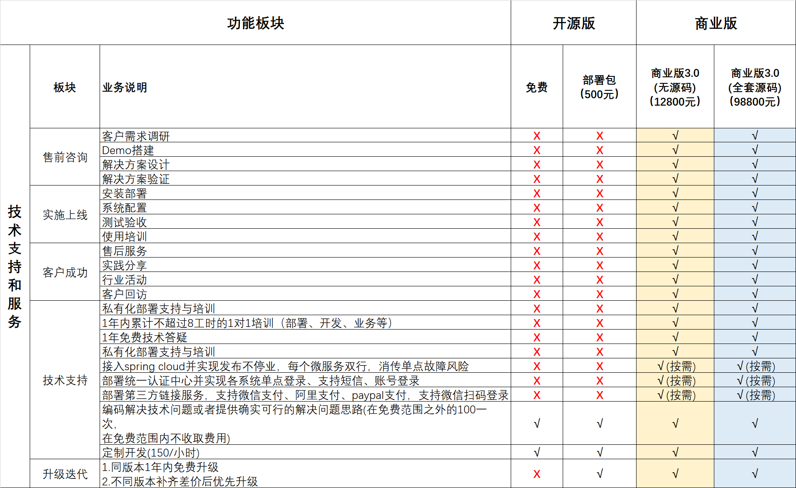
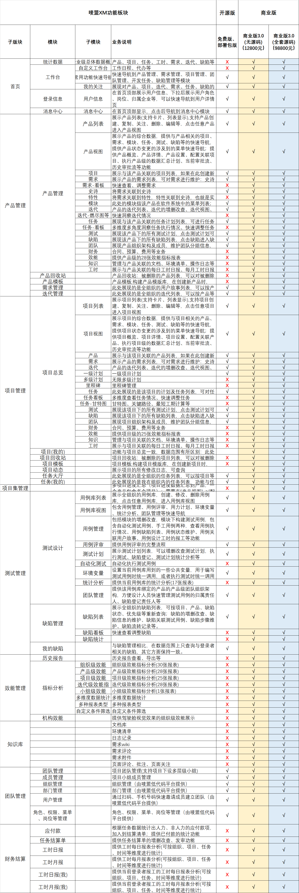

<p align="center">
	<a href="https://maimengcloud.com"  target="_blank">
	    
	</a>
</p>
<p align="center">
	<strong>唛盟xm：涵盖项目规划、需求管理、开发迭代、版本控制、缺陷跟踪、测试管理、工时管理、效能分析等环
节，实现项目全过程、全方位管理的一站式企业研发项目管理解决方案</strong>
</p>

<p align="center">
	<a target="_blank" href="https://gitee.com/maimengcloud/xm-ui-web">
        
    </a> 
</p>
<p align="center">
	👉 <a target="_blank" href="https://maimengcloud.com/xm">https://maimengcloud.com</a>  👈
</p>


## 快速导航   

- [前端组件](https://gitee.com/maimengcloud/xm-ui-web)
- [后端服务](https://gitee.com/maimengcloud/xm-backend)
- [体验环境](https://maimengcloud.com/xm)
  登陆界面上选择演示账号登陆(账号密码：demo-branch-01 888888)或者直接扫码登陆，无须注册  
- 相关教程b站上搜素[唛盟9哥教你撸前后端代码](https://www.bilibili.com/video/BV111421S72r/?spm_id_from=333.337.search-card.all.click&vd_source=93be23d03863773d50b81112985b9237)

## 📢 简介[唛盟xm](/)
唛盟企业级研发管理系统简称唛盟xm,属于唛盟生态的专业子系统之一，以研发管理为核心，涵盖项目规划、需求管理、开发迭代、版本控制、缺陷跟踪、测试管理、工时管理、效能分析等环节，实现全过程、全方位的研发管理。通过该系统，企业能够优化研发流程，提高研发效率，降低研发成本，提高市场竞争力。   
## 💪 特点
1. 全网唯一Vue3开源项目管理系统；前后端均有开源；MIT协议。  
2. 基于唛盟低代码平台构建，二开、升级、维护都非常方便。  
3. 业界新创的进度控制方法，进度流自底向上，从项目、产品双方向进行逐层自动汇总，管理者可以自顶向下逐级钻取。  
项目线：由任务->多层计划->小组->项目->部门->企业  
产品线：由任务->故事->特性->史诗->迭代->产品->部门->企业  
4. 提供史上最全的关于项目管理的各种效能分析工具，全方位帮助你检测项目问题，预测项目风险，过程改进稳步向前推进，分析工具包括不限于人效分析、任务进度分析、测试进度分析等。
5. 真正实现 项目管理->智能分析->过程改进->更好更高效管理 的闭环，能够帮助企业真正实现台账型管理向智能化管理的转变。
6. 人效管理工具解决了业界难题：数据收集困难、计算不科学、不能真实反应真正人效等问题。唛盟xm能够让摸鱼者无处遁形，干事者光芒四射。
7. 唛盟xm业界首创支持一个产品在多个项目同时实施，一个项目同时实施多个产品的模式。支持跨项目迭代产品。正因为此模式，让唛盟xm能够适应几乎所有的项目形态。
8. 唛盟xm提供需求怎么做、产品如何规划、项目如何管理、测试如何开展等等解决方案。
9. 唛盟xm业界首创无保存批量修改数据模式，彻底告别录数据难、修改数据难问题。
10. 字段级别的人性化日志记录方案，任何改动有迹可查。
11. 提供强大的甘特图工具，需求、任务排班方便快捷有效。
12. 唛盟xm3.0打通ai底层脉络，4.0将全面接入唛盟ai工程师(发明专利)，ai时刻即将来临，敬请期待。


## 📢 唛盟生态

💪唛盟生态遵循 <strong>“一个底座+N个专业子系统”</strong> 的架构，基于同一个底座的各个专业子系统可以任意组合形成一个大的业务系统。👉[聊聊唛盟生态1+n架构](https://www.bilibili.com/video/BV1BD421V7Bu/?spm_id_from=333.337.search-card.all.click&vd_source=93be23d03863773d50b81112985b9237)  

### 底座 mdp-core 
  [mdp-core](https://gitee.com/maimengcloud/mdp-core)   
### N个专业子系统
| 唛盟子系统                        | 说明               | 版本     |
|----------------------------------------------------------------------|------------------|--------|
| [低代码、0代码](https://gitee.com/maimengcloud/mdp-lcode-ui-web)| 低代码、0代码框架           | 3.0.0 |
| [账户、权限、组织管理](https://gitee.com/maimengcloud/mdp-lcode-backend/tree/master/mdp-sys)| 账户、权限、组织管理，支持多租户 | 3.0.0  |
| [数据模型](https://gitee.com/maimengcloud/mdp-dm-backend/tree/master/mdp-dm-backend)|表结构设计、表数据增删改查等ddl、dml操作，在线执行sql等  | 3.0.0 |
| [第三方支付登录等](https://gitee.com/maimengcloud/mdp-tpa-backend)  | 微信支付、支付宝支付、paypal支付、第三方登录   | 3.0.0  |
| [统一认证中心](https://gitee.com/maimengcloud/mdp-oauth2-backend) | 短信、微信、账号登录 | 3.0.0 |
| [统一流程中心](https://gitee.com/maimengcloud/mdp-workflow-backend)| 审批、代办、设计流程、监控流程等  | 3.0.0 |
| [短信](https://gitee.com/maimengcloud/mdp-sms-ui-web) | 群发消息              | 3.0.0  |
| [代码生成器](https://gitee.com/maimengcloud/mdp-code-generator)| 自动生成前后端代码          | 3.0.0  |
| [研发项目管理](https://gitee.com/maimengcloud/xm-ui-web)| 产品管理、需求管理、任务计划、迭代、测试、效能等         | 3.0.0  |
| [即时通讯](https://gitee.com/maimengcloud/mdp-im-web)  | 即时通讯、消息、聊天            | 3.0.0  |
| [财务](https://gitee.com/maimengcloud/ac-core-ui-web)| 财务子系统，凭证、报销、会计记账、成本、结算 等          | 3.0.0 |
| [协同办公](https://gitee.com/maimengcloud/oa-ui-web)  | 办公用品、会议、车辆、资产、档案、用印、采购、绩效等功能           | 3.0.0 |

## ⚙ 技术栈
1. 前端  

| 框架                                                                   | 说明               | 版本     |
|----------------------------------------------------------------------|------------------|--------|
| [Vue](https://staging-cn.vuejs.org/)                                 | Vue 框架           | 3.3.8 |
| [Vite](https://cn.vitejs.dev//)                                      | 开发与构建工具          | 4.5.0  |
| [Element Plus](https://element-plus.org/zh-CN/)                      | Element Plus     | 2.4.2 |
| [TypeScript](https://www.typescriptlang.org/docs/)                   | JavaScript 的超集   | 5.2.2  |
| [pinia](https://pinia.vuejs.org/)                                    | Vue 存储库 替代 vuex5 | 2.1.7 |
| [vueuse](https://vueuse.org/)                                        | 常用工具集            | 10.6.1 |
| [vue-i18n](https://kazupon.github.io/vue-i18n/zh/introduction.html/) | 国际化              | 9.6.5  |
| [vue-router](https://router.vuejs.org/)                              | Vue 路由           | 4.2.5  |
| [unocss](https://uno.antfu.me/)                                      | 原子 css          | 0.57.4  |
| [iconify](https://icon-sets.iconify.design/)                         | 在线图标库            | 3.1.1  |
| [wangeditor](https://www.wangeditor.com/)                            | 富文本编辑器           | 5.1.23 |
| [form-create](https://gitee.com/xaboy/form-create/) | 表单引擎+表单设计器           | vue3版 |

2. 后端  

| 框架                                                                   | 说明               | 版本     |
|----------------------------------------------------------------------|------------------|--------|
| spring boot                               | spring boot 框架           | 2.6.11 |
| mybatis plus                                      | 数据库操作框架          | 3.5.3.1  |
| spring security                                   | 安全框架 | 2.1.7 |
| jsqlparse                                     | sql解析引擎            | 4.7+ |
| swagger                                     | 接口说明框架            | 2.2.8 |
| logback                                     | 日志框架            | 1.2.3 |
| jexl13                                     | 表达式引擎            | 3.1|
| flowable                      | 流程引擎-可换     | 6.4.2 |
| spring cloud                                     | cloud框架-可换            | 2020.0.0 |
| spring cloud consul                                    | cloud框架-可换            | 1.10+ |
| spring cloud consul                                    | cloud框架-可换            | 1.10+ |
| spring oauth2                   | 统一认证中心-可换   | 5.2.2  |

## ⚙ 开发工具

前端  
推荐 VS Code 开发，配合插件如下：  

| 插件名                           | 功能                       |
|-------------------------------|--------------------------|
| node.js                       | node.js   建议  21.1.0 +             |
| pnpm                       | 类似npm的构建工具    最新版即可            |
| nvm                      | node版本管理工具，多版本之间切换很好用 最新版即可                |
| TypeScript Vue Plugin (Volar) | 用于 TypeScript 的 Vue 插件  |
| Vue Language Features (Volar) | Vue3.0 语法支持              |
| unocss                        | unocss for vscode           |
| Iconify IntelliSense          | Iconify 预览和搜索           |
| i18n Ally                     | 国际化智能提示               |
| Stylelint                     | Css    格式化               |
| Prettier                      | 代码格式化                   |
| ESLint                        | 脚本代码检查                  |
| DotENV                        | env 文件高亮                 |


后端  
| 插件名                           | 功能                       |
|-------------------------------|--------------------------|
| idea                        | java 开发工具    社区版、企业版都可            |


## 😭 日常项目管理中，您是否有以下痛点？
### 需求管控困难
- 需求不明确：客户提出一些模糊的需求,这可能导致开发团队对需求的理解存在偏差。
- 信息分散、杂乱：需求可能散落在多个地方，如邮件、Excel表格、即时通讯工具、不同的项目组等无法进行统一管理。
- 需求追溯困难：提出者、评审者、实施人等不明确，导致责任不清、分工不明等问题产生。
- 需求与开发脱节：无法实时跟踪需求完成情况。无法实时定位需求进度落后原因，进而无法做出补救措施。
- 需求与测试不匹配：需求文档与测试用例不匹配导致测试工作无法顺利进行
- 需求变更频发：频繁变更需求，给开发团队带来很大的困扰。

### 任务管理困难
- 任务分配不明确：任务通过口头或邮件形式进行分配，这可能导致任务责任不明确和任务重叠。
- 任务发布、沟通困难：由于涉及的成员和部门众多，信息同步不及时，很容易导致项目协作混乱。
- 任务进度把控难：缺乏有效的工具来跟踪任务进度，团队成员很难准确把握项目的整体完成情况，也无法针对性地进行调整。
- 任务风险管理不充分：常常忽视任务风险管理，导致项目面临较大的风险。
- 工时统计困难：手动记录工时不仅容易出错，而且难以统计和分析，这不仅影响团队成员的个人成果统计，也影响团队之间的凝聚力和协作效果。

### 质量管理困难
- 质量标准不明确：缺乏明确的质量标准和规范，导致团队成员对质量要求的理解存在差异，从而影响软件质量。
- 质量保证不到位：导致软件存在缺陷和漏洞，影响用户体验和产品可靠性。
- 测试不全面：缺乏缺陷登记跟踪工具、缺乏测试用例管理工具，导致一些潜在问题未被发现和解决，从而影响软件质量。
- 质量管理与开发流程不融合：质量管理与开发流程相互分离，导致质量管理与开发效率相互影响，难以实现高效的软件开发。

### 缺乏协作&沟通
- 沟通渠道不统一：在开发团队中，不同的成员可能有不同的沟通渠道，导致信息分散，难以统一管理。
- 沟通不够及时：在开发过程中，有时沟通不够及时，导致一些重要信息滞后的处理，影响了项目进度。
- 沟通不够清晰：由于技术术语或背景知识的不同，团队成员之间的沟通有时不够清晰，导致理解上的偏差。
- 沟通缺乏反馈机制：在沟通中，有时缺乏反馈机制，导致对问题的处理不够及时和有效。

### 缺乏效能分析
- 缺乏组织级、项目级、产品级、团队级、个人级、迭代级等不同组织级别的效能分析：企业在长期项目实施过程中，未构建起从组织级到个人级的效能分析体系，无法全面掌握企业的项目运作全貌，进而无法有效进行资源调配，利益最大化。
- 缺乏对不同职能部门的多维度的效能分析
- 缺乏风险预警、风险分析
- 项目报告不全面、不准确
- 质量报告不全面、不准确
- 进度计划汇总、分解困难

## 解决之道


### 系统概况


### 系统特点


### 系统功能


### 技术架构


### 应用架构


### 项目总体管理


### 需求管理


### 项目计划


### 质量管理


### 迭代管理


### 效能分析


## 💪 功能展示
### 项目立项


### 项目总体


### 项目计划与进度

### 项目-甘特图 任务、计划、需求都支持
 

### 关键路径-可以根据关键算法高亮显示关键路径上的横道图


### 任务看板


### 组织架构


### 项目报告


### 需求管理


### 用户故事


### 项目计划


### 项目计划-任务


### 迭代概览


### 迭代维护


### 测试管理


### 测试报告


### 缺陷管理


### 财务-预算

### 财务-费用


### 财务-预算执行分析


### 驾驶舱


### 效能分析


### 人效趋势分析


### 人效排行榜-按产品分组

### 人效排行榜-按人分组


### 燃尽图


### 每日工作项分布


### 任务年龄分布


### 任务排行棒


### 测试用例规划分析


## 客户端展示
### 小程序


### 审批管理


### 测试管理


## 💻 样例项目

- [低代码平台] (https://maimengcloud.com/lcode/) 
- [协同办公] (https://maimengcloud.com/oa)
- [项目管理] (https://maimengcloud.com/xm) 

## ⚙ 快速开始

>⚠️注意：该项目使用 element plus 版本，所以最低兼容 vue@3.0+ nodejs版本v21.1.0

>⚠️注意：强烈建议一定要用pnpm
```js
// 全局安装
npm install pnpm -g
 
//查看源
pnpm config get registry 
//切换淘宝源
pnpm config set registry https://registry.npmmirror.com/
 
// 使用
pnpm install 包 // 安装依赖

```

### 前序准备

- 当前项目属于网页版前端ui项目，后端代码请移步到 [xm-backend](https://gitee.com/maimengcloud/xm-backend)
### 开发
```bash
# 克隆项目
git clone https://gitee.com/maimengcloud/xm-ui-web.git

# 安装依赖
pnpm install 

# 启动服务
pnpm run dev
```
浏览器访问 http://localhost:8067

#### 登录相关
登录api，对接后台接口有两种方式:  
1. 对接统一认证中心  
```js
 VITE_CTX_LOGIN=oauth2client
```
2. 对接mdp-lcode-backend进行登录
```js
 VITE_CTX_LOGIN=lcode
```

#### 图片库、素材库、标签库
内容相关接口默认打包进mdp-lcode，所以内容相关接口可以直接对接lcode即可，如果内容相关的服务使用独立的第三方开源工程，独立部署，比如直接使用 [mdp-arc-backend](https://gitee.com/maimengcloud/mdp-arc-backend)  
1. 对接mdp-arc-backend
```js
   VITE_CTX_ARC=arc

   # 配置附件上传的接口，如果不配使用arc内置的地址
   VITE_UPLOAD_ATT_URL=

   # 配置图片上传的接口，如果不配使用arc内置的地址
   VITE_UPLOAD_IMAGE_URL=
   
```
2. 对接mdp-lcode-backend
```js
  VITE_CTX_ARC=lcode

  # 配置附件上传的接口，如果不配使用arc内置的地址
  VITE_UPLOAD_ATT_URL=

  # 配置图片上传的接口，如果不配使用arc内置的地址
  VITE_UPLOAD_IMAGE_URL=
```

#### 前后端对接 

前后端对接，涉及api/xm,api/lcode,api/arc,api/oauth2client,api/workflow,api/tpa等开头的api 
```js  
    ['/api/xm']: {//低代码平台
      target: 'http://localhost:7067',
      ws: false,
      changeOrigin: true,
      rewrite: (path) => path.replace(new RegExp(`^/api/xm`), '/'),
    },
    ['/api/lcode']: {//低代码平台
      target: 'http://localhost:7014',
      ws: false,
      changeOrigin: true,
      rewrite: (path) => path.replace(new RegExp(`^/api/lcode`), '/'),
    },
    ['/api/oauth2client']: {//登录相关,如果VITE_CTX_LOGIN=lcode,此代理不需要配置，走的是lcode的代理
      target: 'localhost:7014',//如果对接统一认证中心，此处应该改为oauth2client的端口，默认对接lcode
      ws: false,
      changeOrigin: true,
      rewrite: (path) => path.replace(new RegExp(`^/api/oauth2client`), '/'),
    },
    ['/api/arc']: {// 图片、文件、标签、分类等,如果VITE_CTX_ARC=lcode,此代理不需要配置，走的是lcode的代理
      target: 'localhost:7014',//如果对接arc-backend，此处应该改为arc的端口，默认对接lcode
      ws: false,
      changeOrigin: true,
      rewrite: (path) => path.replace(new RegExp(`^/api/arc`), '/'),
    },
    ['/api/workflow']: {//工作流
      target: 'localhost:7080',
      ws: false,
      changeOrigin: true,
      rewrite: (path) => path.replace(new RegExp(`^/api/workflow`), '/'),
    },
    ['/api/tpa']: {//第三方微信、支付宝登录，支付，二维码等
      target: 'localhost:7012',
      ws: false,
      changeOrigin: true,
      rewrite: (path) => path.replace(new RegExp(`^/api/tpa`), '/'),
    },
    ['/api']: {//保底代理
      target: 'http://localhost:7014', //不匹配的请求，全部转向lcode
      ws: false,
      changeOrigin: true,
      rewrite: (path) => path.replace(new RegExp(`^/api`), '/'),
    }, 
```
上述代理实现把以/api/*开头的请求地址(举例/api/lcode/user/list)替换为/user/list,并转发到  http://服务器上的ip:端口 地址  


### 构建

```bash
# 构建测试环境
pnpm run build:test

# 构建生产环境
pnpm run build:prod
```

### 发布
假设：  
1. 应用服务器(sit1-backend),ip为192.168.0.222,端口7067
2. 静态资源服务器(sit1-static),ip为192.168.0.111
3. 反向代理使用nginx
4. 静态资源部署到服务器sit1-static的/data/nginx/html/xm/下
5. 本地*ui-web目录在C:/Users/xxx/IdeaProjects/xm-ui-web/

#### 发布静态资源到测试\生产环境

```bash
# 1.首先登录sit1-static并进入/data/nginx/html/xm/下

cd /data/nginx/html/xm/
# 如果有dist.rar需要先删除
rm -rf dist.rar


# 2.执行rz命令，弹框选择本地dist文件上传到sit1-static服务器
rz 

# 3.在弹出的目录选择器中进入C:\Users\xxx\IdeaProjects\xm-ui-web\dist\目录下
全选所有文件->右键->添加到dist.rar->选中dist.rar->上传到服务器商/data/nginx/html/xm/目录下

# 4.执行解压缩命令，至此静态资源发布完成
unrar x dist.rar
解压后m1目录下一般有css、fonts、images、img、js、tinymce、favicon.icon、index.html等文件或者文件夹
```

#### nginx的配置
##### 静态资源的访问映射
```
   location ~*/(mk|mallm|arc|im|sms|workflow|oa|ac|audit|xm|tpa|crowd|lcode) {
    root /usr/share/nginx/html;
    index index.html;
    expires 30d;
  }

```

##### 后端相关api的映射配置(单体应用方式部署的后端)
api/xm, api/lcode, api/arc, api/workflow, api/tpa,等api配置，每个都是同样的逻辑
```
  # lcode 低代码相关api
    upstream api-gate-lcode {
        server 192.168.0.222:7014;
    }

  location /api/lcode/ {
    #proxy_redirect off;
    proxy_set_header Host $host;
    proxy_set_header X-Real-IP $remote_addr;
    proxy_set_header X-Forwarded-For $proxy_add_x_forwarded_for;
    proxy_pass http://api-gate-lcode/;
    proxy_connect_timeout 65s;
    proxy_send_timeout 65s;
    proxy_read_timeout 65s;
    proxy_next_upstream_tries 1;
  }

  # workflow 工作流相关api
    upstream api-gate-workflow {
        server 192.168.0.222:7080;
    }

  location /api/workflow/ {
    #proxy_redirect off;
    proxy_set_header Host $host;
    proxy_set_header X-Real-IP $remote_addr;
    proxy_set_header X-Forwarded-For $proxy_add_x_forwarded_for;
    proxy_pass http://api-gate-workflow/;
    proxy_connect_timeout 65s;
    proxy_send_timeout 65s;
    proxy_read_timeout 65s;
    proxy_next_upstream_tries 1;
  }

  # arc 内容相关api
   upstream api-gate-arc {
    # 如果由lcode提供服务，可以指向lcode所在端口7014
        server 192.168.0.222:7012;
    }

  location /api/arc/ {
    #proxy_redirect off;
    proxy_set_header Host $host;
    proxy_set_header X-Real-IP $remote_addr;
    proxy_set_header X-Forwarded-For $proxy_add_x_forwarded_for;
    proxy_pass http://api-gate-arc/; 
    proxy_connect_timeout 65s;
    proxy_send_timeout 65s;
    proxy_read_timeout 65s;
    proxy_next_upstream_tries 1;
  }
  
  # xm 项目管理相关api
   upstream api-gate-xm {
        server 192.168.0.222:7067;
    }

  location /api/xm/ {
    #proxy_redirect off;
    proxy_set_header Host $host;
    proxy_set_header X-Real-IP $remote_addr;
    proxy_set_header X-Forwarded-For $proxy_add_x_forwarded_for;
    proxy_pass http://api-gate-xm/;
    proxy_connect_timeout 65s;
    proxy_send_timeout 65s;
    proxy_read_timeout 65s;
    proxy_next_upstream_tries 1;
  } 

  # oauth2client 登录相关api
  upstream api-gate-oauth2client {
    # 如果由lcode提供服务，可以指向lcode所在端口7014
      server 192.168.0.222:7002;
  }

  location /api/oauth2client/ {
    #proxy_redirect off;
    proxy_set_header Host $host;
    proxy_set_header X-Real-IP $remote_addr;
    proxy_set_header X-Forwarded-For $proxy_add_x_forwarded_for;
    proxy_pass http://api-gate-oauth2client/;
    proxy_connect_timeout 65s;
    proxy_send_timeout 65s;
    proxy_read_timeout 65s;
    proxy_next_upstream_tries 1;
  }

  
  # tpa 第三方微信/支付宝登录、支付等相关api
  upstream api-gate-tpa { 
      server 192.168.0.222:7125;
  }

  location /api/tpa/ {
    #proxy_redirect off;
    proxy_set_header Host $host;
    proxy_set_header X-Real-IP $remote_addr;
    proxy_set_header X-Forwarded-For $proxy_add_x_forwarded_for;
    proxy_pass http://api-gate-tpa/;
    proxy_connect_timeout 65s;
    proxy_send_timeout 65s;
    proxy_read_timeout 65s;
    proxy_next_upstream_tries 1;
  }
``` 


##### api的映射配置(cloud方式部署的后端)
假设 spring cloud gate部署在192.168.0.222，监听6101端口
下面的目标服务器改为cloud gate的地址端口.
注意cloud环境下不需要像单体般每个子系统api单独配置映射关系。因为所有的api都是经过gate再转发的
```
    upstream api-gate {
        server 192.168.0.222:6101;
    } 
    location /api/ {
      #proxy_redirect off;
      proxy_set_header Host $host;
      proxy_set_header X-Real-IP $remote_addr;
      proxy_set_header X-Forwarded-For $proxy_add_x_forwarded_for;
      proxy_pass http://api-gate/;
      proxy_connect_timeout 65s;
      proxy_send_timeout 65s;
      proxy_read_timeout 65s;
      proxy_next_upstream_tries 1;
  }
```

#### 发布后端服务
具体以[xm-backend](https://gitee.com/maimengcloud/xm-backend)中发布描述为准

### 运维
#### 日志查询
日常查询问题，主要通过查询前后端日志，分析出具体原因，再进行针对性解决。
唛盟平台具有多个子业务系统，每个子业务系统都有独立日志，一个前端请求，可能日志散落在多个日志文件，如何才能凑齐这些日志，进行统一分析交易执行情况，进而定位问题？  
答复：唛盟平台在每个请求到达服务端的时候，会检测gloNo是否存在，如果不存在，则会自动创建一个gloNo,并注入到日志上下文中，并打印到每一行代码中，另外请求结束，还会把gloNo返回到前端，如果交易中间涉及调用其他子系统，同样会自动上送gloNo，对方交易子系统同样执行上诉逻辑。因此，可以看见，gloNo是能够把所有日志串联起来的。我们只需要在日志文件目录下执行grep命令即可找出对应日志  
操作步骤：  
1.下面是典型的唛盟接口返回的数据结果集 gloNo就存放在res.data.tips.gloNo中。 
```
{
  "total" : 1,
  "data" : [ {
    "bizFlowState" : null,
    "deptName" : null,
    "projectCnt" : 1,
    "admUserid" : "4hinb8m16",
    "del" : "0",
    "budgetNouserAt" : null,
    "productName" : "唛盟云-财务系统",
    "baselineId" : "2022-01-01-base-01", 
  }],
  "tips" : {
    "msg" : "成功",
    "gloNo" : "20240312200013556UWJZKV",
    "isOk" : true,
    "reqNo" : "20240312200013556JM3WKN",
    "tipscode" : "ok"
  }
}
```
2. 通过gloNo到logs目录下执行

```
grep "20240312200013556UWJZKV" *.log
```

#### 服务状态监控
consule 的默认控制台
http://ip:8500/

#### 有时候微服务需要人为干预进行下架
可以调用[/bin/service-deregister.sh](https://gitee.com/maimengcloud/xm-backend/blob/master/bin/service-deregister.sh)进行

#### 日志定时备份清理
可以在crontab中配置定时任务，定时调用[bin/clear-log.sh](https://gitee.com/maimengcloud/xm-backend/blob/master/bin/clear-log.sh)即可完成7天循环自动清理及备份日志

使用举例： 
```bash
# 打开定时任务编辑器
crontab -e  
# 查看定时任务
crontab -l 
# 增加定时清理备份日志任务
0 1 * * * /bin/bash /home/mall/bin/clear-log.sh

```


### 🔔️ 开发计划与进度情况 

#### 3.x.x (当前版本，已完成大部分内容) 
1. 所有的树状结构支持自由拖动，达到快速调整上下级关系目的
2. 任务、故事、计划、里程碑、缺陷、测试计划等分别支持动态看板、支持甘特图浏览编辑等
3. 增加预算管理、成本管理、预算与成本支出比对，任务结算管理等
4. 立项、预算变更、成本变更等重大节点提供流程审批功能
5. 进一步整合协同办公系统
   
#### 4.x.x (下一版本，让我们一起拥抱ai起飞吧)
1. 提供接入大模型能力
2. 提供前端任意字段起调ai能力
3. 提供ai编程、ai测试、ai编排任务、ai需求整理能力
4. 提供ai出报告能力
5. 提供ai基于企业私有数字资产自训练能力

### 🗒️ 版本更新日志

#### 2.0.0-RELEASE 
  已发布，停更
#### 3.0.0-RELEASE
 已发布，持续改进

#### 4.0.0-BETA
  预研中 


## 📝 常见问题  
 唛盟xm基于唛盟低代码平台开发，问题都是共性的，请到[唛盟低代码](https://gitee.com/maimengcloud/mdp-lcode-ui-web)查看相关内容
## 💯 实践案例

1. [低代码平台](https://maimengcloud.com/lcode)
1. [系统管理](https://maimengcloud.com/lcode)
2. [协同办公](https://maimengcloud.com/oa)
3. [唛盟众包-网页](https://maimengcloud.com) 
3. [项目管理-网页](https://maimengcloud.com/xm) 
4. 项目管理-小程序   
   
5. [流程管理](https://maimengcloud.com/lcode/)
 
### 项目分支说明

| 分支     | 说明                                            |
|--------|-----------------------------------------------|
| master | 主分支，3.0.0+,受保护分支，此分支不接受 PR。在 dev 分支后经过测试没问题后会合并到此分支。 |
| 3.0.0-RELEASE    | 已发布的版本3.0。                    | 
| 2.0.0-RELEASE    | 已发布的版本2.0。                    |

## 🐞 交流讨论 、反馈 BUG、提出建议等

1. 快扫描下方左侧微信二维码和我们一起交流讨论吧！（备注 唛盟-mdp 进群） 


2. 唛盟微信公众号查看一些基础教程  


3. 反馈 BUG、提出建议，欢迎新建：[issues](https://gitee.com/maimengcloud/xm-ui-web/issues)，开发人员会不定时查看回复。
4. 参与贡献，请查看[贡献指南](#🔨贡献指南)。

## 💲 打赏
 **感谢所有赞赏以及参与贡献的小伙伴，你们的支持是我们不断更新前进的动力！微信扫一扫，赏杯咖啡呗！**    
 

## 🔔商务合作 

序号|合作项目| 详细介绍 | 费用说明|
----------------------|------------|----------------------|-----|
1.| 打赏获得赞助商名额| 在赞助商列表展示（添加微信沟通） |不限额度|
2.| 新组件开发| 提供组件扩展、优化服务 |视复杂程度而定|
3.| 开发问题解答|如果使用该产品遇到棘手问题需要解决，添加微信进行沟通解决 |免费|
4.| 开发培训|提供开发流程介绍、技术介绍、功能介绍、部署流程介绍，仅限线上培训 |加微信详聊|
5.| 扩展问题解答|如果需要使用该产品进行自有业务系统研发，需要我方提供意见建议，我方收取一定费用后提供相应服务 |加微信详聊|
6.| 广告合作|广告位(精品项目推荐、赞助商展位) |加微信沟通|

### 商业版与开源版对比

注意：如果需要商业使用又不想带擎勤的版权说明，请联系唛盟客服申请版权授权
#### 技术支持与服务 



#### 功能列表 


## 📢 视频教程(2.**的视频教程)   

[0.1-唛盟-唛盟生态1+n架构无限扩展、丝滑部署、永不下线](https://www.bilibili.com/video/BV1BD421V7Bu/?spm_id_from=333.788.recommend_more_video.1&vd_source=93be23d03863773d50b81112985b9237)  

[1.唛盟-总体介绍](https://www.bilibili.com/video/BV111421S72r/?vd_source=93be23d03863773d50b81112985b9237)  

[2.唛盟-工程结构介绍](https://www.bilibili.com/video/BV1Nu4m1T7hc/?spm_id_from=333.788.recommend_more_video.0&vd_source=93be23d03863773d50b81112985b9237)  

[3.唛盟-工程结构-后端内部结构介绍](https://www.bilibili.com/video/BV1Lj421d7Xb/?spm_id_from=333.788.recommend_more_video.3&vd_source=93be23d03863773d50b81112985b9237)  

[4.唛盟-工程结构-前端内部结构介绍](https://www.bilibili.com/video/BV1ut421V7un/?spm_id_from=333.788.recommend_more_video.2&vd_source=93be23d03863773d50b81112985b9237)  

[5.唛盟-智能表单-代码生成等模块介绍](https://www.bilibili.com/video/BV1UH4y1p7uJ/?spm_id_from=333.788.recommend_more_video.16&vd_source=93be23d03863773d50b81112985b9237)  

[5.0-唛盟-前后端开发新手攻略](https://www.bilibili.com/video/BV1aC411t7rG/?vd_source=93be23d03863773d50b81112985b9237)

[6.唛盟-用户、权限、菜单、组织管理等模块介绍](https://www.bilibili.com/video/BV18m411k7rq/?spm_id_from=333.788.recommend_more_video.5&vd_source=93be23d03863773d50b81112985b9237)  

[7.唛盟-前端工程开发、部署流程介绍](https://www.bilibili.com/video/BV1ut421G7ec/?spm_id_from=333.788.recommend_more_video.5&vd_source=93be23d03863773d50b81112985b9237)  

[8.唛盟-后端工程开发、部署流程介绍](https://www.bilibili.com/video/BV1hx421k7tm/?spm_id_from=333.788.recommend_more_video.5&vd_source=93be23d03863773d50b81112985b9237)  

[8.1.唛盟-后端工程开发-mdp-core介绍](https://www.bilibili.com/video/BV1EC41187jE/?spm_id_from=333.788.recommend_more_video.8&vd_source=93be23d03863773d50b81112985b9237)  

[8.2.唛盟-后端工程开发-控制层、服务层、dao层开发详细介绍](https://www.bilibili.com/video/BV1vu4m1T7V6/?spm_id_from=333.788.recommend_more_video.7&vd_source=93be23d03863773d50b81112985b9237)  

[8.3.唛盟-如何部署单体应用](https://www.bilibili.com/video/BV1df421d75w/?spm_id_from=333.788.recommend_more_video.2&vd_source=93be23d03863773d50b81112985b9237)  

[9.1.唛盟-本地开发前后端如何对接的](https://www.bilibili.com/video/BV1Ym421n7Vh/?vd_source=93be23d03863773d50b81112985b9237)  

[9.2.唛盟-前端编译报错如何解决](https://www.bilibili.com/video/BV1PC411b7qY/?spm_id_from=333.788.recommend_more_video.6&vd_source=93be23d03863773d50b81112985b9237)  

[9.4.唛盟-日志规范及如何快速定位问题](https://www.bilibili.com/video/BV1Hm421n7Qv/?spm_id_from=333.788.recommend_more_video.2&vd_source=93be23d03863773d50b81112985b9237)  

[10-唛盟-超强查询接口实现方案、原理解析](https://www.bilibili.com/video/BV1Ct421g72j/?vd_source=93be23d03863773d50b81112985b9237)  

[10.1-唛盟-复杂查询、多主键crud的实现方案、原理解析](https://www.bilibili.com/video/BV1KH4y1H7eM/?vd_source=93be23d03863773d50b81112985b9237)

[11-唛盟-超强批量更新接口实现方案、原理解析](https://www.bilibili.com/video/BV1V1421D7z6/?vd_source=93be23d03863773d50b81112985b9237)  

[12-唛盟-多数据源的实现方案、常见问题解决办法解析](https://www.bilibili.com/video/BV1Zp421y7ty/?vd_source=93be23d03863773d50b81112985b9237)

[13-唛盟-后端国际化多语言版的实现方案、原理解析](https://www.bilibili.com/video/BV1at421n7JW/?spm_id_from=333.337.search-card.all.click&vd_source=93be23d03863773d50b81112985b9237)

[14-唛盟-流程整合、原理解析](https://www.bilibili.com/video/BV13x4y1v7qX/?vd_source=93be23d03863773d50b81112985b9237)

[15-唛盟-分布式数据字典的实现方案、使用示例详解](https://www.bilibili.com/video/BV1hE421g7FT/?spm_id_from=333.788&vd_source=93be23d03863773d50b81112985b9237)


## 📢工程介绍
👉[唛盟-工程结构介绍](https://www.bilibili.com/video/BV1Nu4m1T7hc/?spm_id_from=333.337.search-card.all.click&vd_source=93be23d03863773d50b81112985b9237)
>⚠️工程分类：主体工程、基础配套工程、高级配套工程、拓展应用工程、辅助开发工具五大类。  
> 主体工程：本系统业务工程，用于书写本系统相关的业务代码；  
> 基础配套工程：业务工程运行所需的必要工程；如开发底座，系统管理相关功能包  
> 高级配套工程：高级应用，比如需要将业务工程接入oauth2环境、将业务工程发布到cloud环境，才需要下载安装高级配套工程   
> 拓展应用工程： 基于唛盟低代码平台拓展的应用工程，其后端可以单体发布，也可以以微服务方式发布，也可以打成jar被唛盟其它应用引入   
> 辅助开发工具：指开发用到的一些工具  

>⚠️工程命名规范：业务名称+工程属性  
> 工程属性如下：  
> -ui: 页面工程  
> -web: pc端运行的浏览器工程  
> -backend: 后端服务  
> -app: 安卓、ios等原生app工程  
> -uniapp: 基于uniapp开发的应用  
> -minapp: 小程序   
> -cloud: 微服务cloud环境  
> -oauth2: 统一认证中心   
> -bootstrap: 打包部署工程

### 唛盟主体工程
唛盟属于前后端严格分离的一套系统，分为前端工程、后端工程两部分
- [mdp-lcode-ui-web](https://gitee.com/maimengcloud/mdp-lcode-ui-web)
唛盟的前端工程,以vue.js为主
- [mdp-lcode-backend](https://gitee.com/maimengcloud/mdp-lcode-backend)
唛盟的后端工程，java语言为主  

### 基础配套工程

- [mdp-core 启动后端的话必须先安装此工程](https://gitee.com/maimengcloud/mdp-core)   
  该工程作为所有后端的公共封装，不包含任何的业务功能，仅作为后端系统的技术底座，包含一些公共工具、服务类抽象、dao层抽象等。
  
### 高级配套工程
- [mdp-cloud-backend 非必须](https://gitee.com/maimengcloud/mdp-cloud-backend)   
  该工程作为spring cloud的扩展工程，如果需要将系统发布到spring cloud环境，需要下载该工程重新打包，不包含任何的业务功能，仅作为后端接入cloud环境使用

- [mdp-oauth2-backend 非必须](https://gitee.com/maimengcloud/mdp-oauth2-backend)   
  该工程为统一认证中心，作为spring oauth2的扩展工程，如果需要将系统接入oauth2环境，需要下载该工程重新打包，该工程实现分布式单点登陆；支持微信、支付宝、短信、账户密码等多种登陆方式

### 开发辅助工具
- [mdp-code-generator 非必须](https://gitee.com/maimengcloud/mdp-code-generator) 代码生成器  
  生成代码两种方式，  
  一、使用代码生成器本地工程，好处是代码可以直接覆盖到本地业务工程，避免复制黏贴出错。  
  二、如果不需要本地生成代码，也可以在低代码平台在线生成。[在线生成代码](https://maimengcloud.com/lcode/#/mdp/lcode/gen)

### 拓展应用工程
- 拓展应用工程： 基于唛盟低代码平台拓展的应用工程，其后端可以单体发布，也可以以微服务方式发布，也可以打成jar被唛盟其它应用引入   